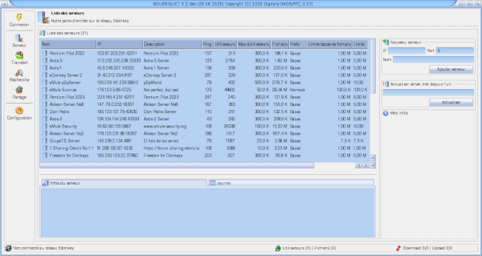

# &nbsp;

Bourriquet is a P2P (peer-to-peer) application written for the MorphOS system.

## Features

* Straightforward installation and configuration, taking only a few seconds to set everything up.
* Runs "Out-of-the-Box" without any installation or Assign required.
* Easy operation using toolbar buttons, menus, keyboard.
* Freely customisable interface, thanks to MUI.
* Context-sensitive online help system, using help bubbles and online documentation.
* Context sensitive menus for direct operations.
* Localised to many languages.

## Downloads/Releases

All releases up to the most current ones can be downloaded from our [central releases management](https://github.com/digitallytechno/bourriquet/releases). In addition to the standard releases, i will suggest also offering regular development builds of the most recent code taken from this code repository. 

## Contributing

There are several ways how you can potentially contribute to this project. One important way to contribute to Bourriquet is to actually *report bugs/issues* you might identify. In addition you can also bring up feature/enhancements requests by using our [central issue tracker](https://github.com/digitallytechno/bourriquet/issues). Another way is to *help us translating* the user interface to a wide range of different languages.

## Development

Contributing your own code/modifications to Bourriquet is quite straight forward since you can use the nice resources of GitHub and submit your changes in terms of [pull requests](https://github.com/digitallytechno/bourriquet/pulls).
If you, however, feel you might be better suited to join me directly and you would like to directly submit your changes to this code repository i can easily provide you direct write access. 

## License & Copyright

bourriquet is distributed and license under the GNU General Public License Version 2. See [COPYING](COPYING) for more detailed information.

## Authors / Contributors

See [contributors list](https://github.com/digitallytechno/bourriquet/graphs/contributors) for all contributions.
